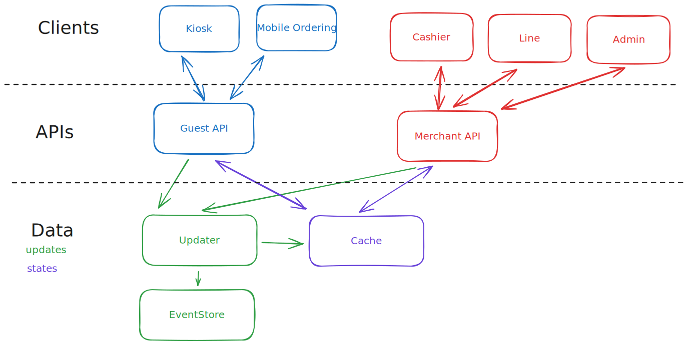

# Fantasy BOBA (an event sourcing demo)

Welcome to Fantasy Boba!  This is a demo ordering / fulfillment system for a fictional bubble tea restaurant, complete with:

* Ordering app
* Ordering kiosk
* Fulfillment app
* Menu updating (with automatic updates pushed everywhere)
* User analytics

This will incorporate the following technologies and techniques

* Event Sourcing
* Microservices
* gRPC & GraphQL

## Checklist

### Main Goals

- [ ] Create an API that can create orders for a bubble tea restaurant
- [ ] Create a client web app to consume the API    
- [ ] Create a line app for completing orders
- [ ] Create an admin dashboard to create menu items

### Stretch Goals

- [ ] Incorporate Stripe for payments
- [ ] Create a touchscreen Kiosk setup
- [ ] Incorporate SMS notifications
- [ ] Handle the "86" case (an item that has already been ordered is cancelled from the menu).

## Schema